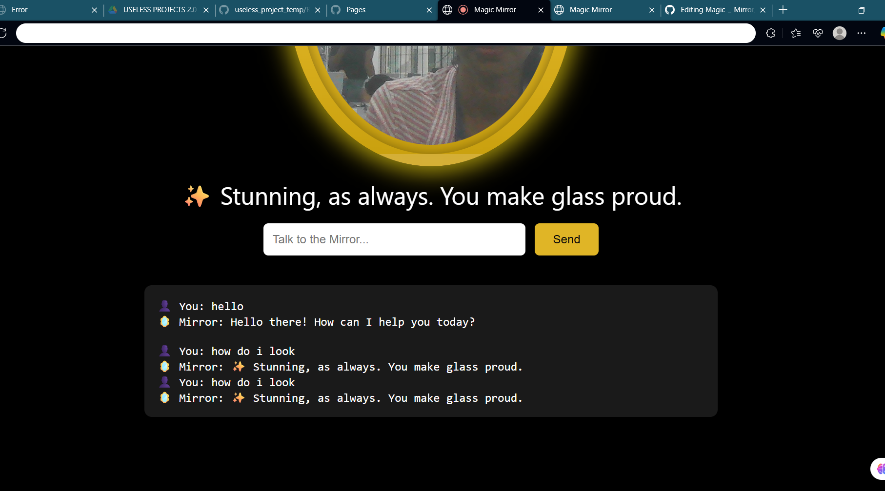
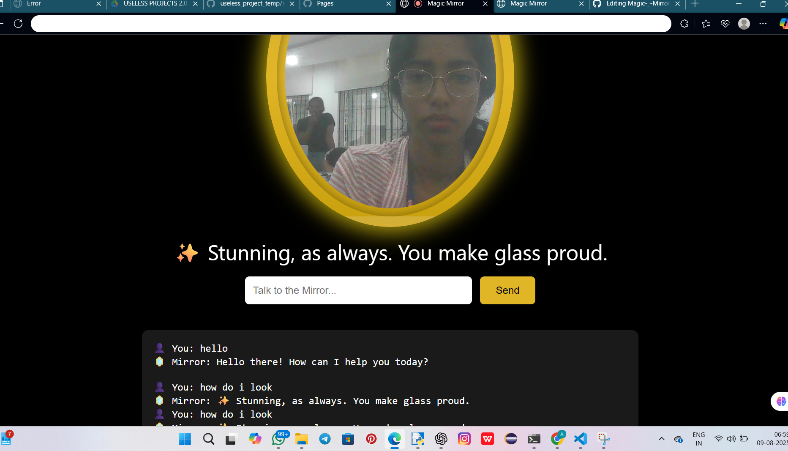
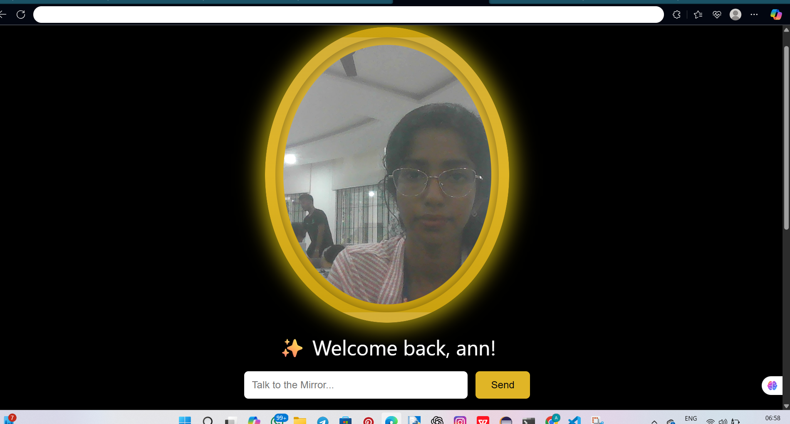

Project Name- MAGIC MIRROR 🎯
Basic Details
Team Name: COMMENTS
Team Members

Member 1: [Ann Mary Chacko] - [Muthoot Institute of Science And Technology]
Member 2: [Bisni K B] - [Muthoot Institute of Science And Technology]

Project Description

A sassy, antique-themed smart mirror website that identifies you via face recognition. If you’re the owner, it showers you with sarcastic praises. If you’re a stranger… it roasts you mercilessly. Includes offline support,and a password-protected login.

The Problem (that doesn't exist)

People are tired of boring mirrors that silently judge them without saying a word. Where’s the drama? Where’s the sass? Where’s the passive-aggressive energy we need to start the day?

The Solution (that nobody asked for)

We built a digital mirror that talks back — literally. Using AI, it flatters its owner like they’re royalty while giving strangers a roast so spicy, they might just cry. It’s like having a stand-up comedian trapped inside a mirror… forever.

Technical Details

Technologies/Components Used
For Software:

- **Languages:** HTML, CSS, JavaScript
- **Frameworks:** None (Vanilla JS, baby!)
- **Libraries:** face-api.js, service workers for offline mode
- **Tools:** Google Gemini API, localStorage for owner authentication

For Hardware:
Just your device’s webcam (and a brave heart to face the roast)

Implementation
For Software:

1. Prerequisites

Node.js (v18 or higher recommended)
npm (comes with Node)
A webcam (or external camera)
Internet connection (unless you have downloaded offline face recognition models)

Installation

# Clone the repository
git clone https://github.com/annmary176/magic-mirror.git
cd magic-mirror

# Install required dependencies
npm install

# If you get 'ERR_MODULE_NOT_FOUND' for node-fetch:
npm install node-fetch

Run
# Start the development server
npm start

Project Documentation
For Software:

Screenshots (Add at least 3)
 chat

 replying to message

recognising face

Diagrams
 Add caption explaining your workflow

Project Demo
Video
[(./mirrorvideo.mp4)] working of our project

Team Contributions
[Ann Mary Chacko]: front end creation
[Bisni K B]: Back end creation

